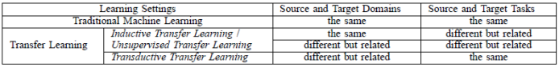

# AI_Winter_School
대한기계학회 2022동계 인공지능 강습

1. Pre-trained Models
- TensorFlow Hub

2. Transfer Learning \\

- Inductive transfer learning
- Transductive transfer learning
- Unsupervised transfer learning
